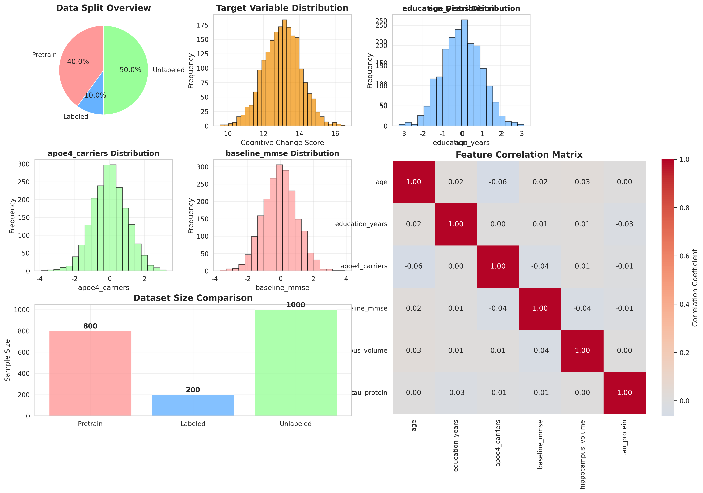

# **预测驱动统计推断：一项模拟研究**

**数据科学导论实验报告**


## **摘要**

本项目旨在评估预测驱动推断（Prediction-Powered Inference, PPI）框架在结合少量标注数据、大量未标注数据及机器学习模型预测以提升统计推断效率方面的性能。通过模拟一个类似阿尔茨海默病神经影像学倡议（ADNI）的数据集，我们比较了PPI方法与经典统计推断（仅依赖少量标注数据）和朴素机器学习推断（直接使用所有预测值）的表现。实验结果表明，PPI方法能够在保持名义覆盖率的同时，有效缩小置信区间宽度，并显著降低估计偏差，从而验证了其在数据稀缺场景下增强统计推断能力的潜力。

---

## **1. 引言**

### **1.1. 背景与动机**

在许多科学研究和商业决策中，获取大规模高质量的标注数据（"金标准"）成本高昂且耗时。然而，未标注数据和强大的预训练机器学习模型却日益普及。传统的统计推断方法在标注数据稀缺时面临统计功效不足的问题，而直接将机器学习模型的预测结果用于下游统计分析，则可能因模型偏差导致推断失效。预测驱动推断（PPI）框架的提出，旨在弥合机器学习预测能力与统计推断有效性要求之间的鸿沟。

### **1.2. 问题陈述**

本项目探讨的核心问题是：当拥有少量标注数据、大量未标注数据以及一个（可能不完美的）机器学习预测模型时，如何有效地结合这些信息进行可靠的统计推断（如均值估计和置信区间构建）？我们旨在量化PPI方法相对于仅使用标注数据的经典方法和直接使用模型预测的朴素方法的性能增益。

### **1.3. 项目目标**

1.  实现一个基础的PPI框架用于总体均值的估计。
2.  生成一个模拟的医学数据集，以模拟真实世界中数据稀缺和模型不完美的场景。
3.  比较PPI方法、经典统计方法和朴素ML方法在估计偏差、置信区间宽度和覆盖率方面的表现。
4.  通过可视化展示不同方法的性能差异。
5.  撰写实验报告，总结研究发现。

---

## **2. 方法论**

### **2.1. 预测驱动推断 (PPI)**

PPI的核心思想是利用少量标注数据来校正由机器学习模型在大量未标注数据上产生的预测偏差。对于总体均值 `μ` 的估计，PPI估计量 `μ̂_PPI` 可以表示为：

```
μ̂_PPI = (1/N) * Σ f(X_i') - (1/n) * Σ [f(X_j) - Y_j]
```

其中：
- `N` 是未标注样本的数量，`X_i'` 是未标注样本的特征。
- `n` 是标注样本的数量，`(X_j, Y_j)` 是标注样本的特征和真实标签。
- `f(X)` 是机器学习模型的预测函数。
- 第一项是基于大量未标注数据预测的（可能有偏的）均值。
- 第二项是校正项，估计了模型预测 `f(X)` 与真实标签 `Y` 之间的平均偏差。

PPI估计量的渐近方差允许构建具有理论保证的置信区间。

### **2.2. 基准方法**

1.  **经典统计推断 (Classical)**:
    -   仅使用 `n` 个标注样本 `(X_j, Y_j)`。
    -   均值估计: `μ̂_classical = (1/n) * Σ Y_j`。
    -   基于t分布构建置信区间。

2.  **朴素机器学习推断 (Naive ML)**:
    -   利用模型 `f(X)` 对所有 `n` 个标注样本和 `N` 个未标注样本进行预测，得到 `n+N` 个预测值 `Ŷ_all`。
    -   均值估计: `μ̂_naive = (1/(n+N)) * Σ Ŷ_all`。
    -   通常假设预测值是真实的，并基于此构建置信区间（可能导致覆盖率不足）。

### **2.3. 数据生成与预处理**

我们通过 `src/data_generator.py` 模块生成了一个模拟的医学数据集，其特征旨在模拟阿尔茨海默病研究中的常见变量。
-   **特征**: 包括年龄、教育年限、APOE4基因携带状态、基线MMSE评分、海马体积和Tau蛋白水平等。
-   **目标变量**: 模拟的12个月认知变化评分。
-   **数据划分**: 数据被划分为预训练集（用于训练预测模型 `f(X)`）、标注集（少量，包含真实标签）和未标注集（大量，仅有特征）。

### **2.4. 预测模型 `f(X)`**

一个梯度提升回归模型 (`GradientBoostingRegressor` from scikit-learn) 在预训练集上进行训练，用于预测目标变量。模型的"不完美性"通过限制其复杂度（如`n_estimators`, `max_depth`）并引入少量预测噪声来模拟。

---

## **3. 实验设置**

基于 `results/experiment_results.json` 文件的数据：

-   **数据集**:
    -   标注集大小 (`n_labeled`): {n_labeled}
    -   未标注集大小 (`n_unlabeled`): {n_unlabeled}
    -   总用于推断的特征数量: {num_features} (基于 `data_info.feature_names`)
-   **预测模型 `f(X)` 性能**:
    -   在标注集上的 R²: {model_r2:.3f}
    -   在标注集上的 MSE: {model_mse:.3f}
-   **真实总体均值 (用于评估)**: {true_value:.4f} (基于未标注数据的真实标签均值)
-   **置信水平**: 95% (α = 0.05)

---

## **4. 实验结果与分析**

### **4.1. 方法比较概述**

下表总结了三种推断方法在估计总体均值时的性能：

| 方法          | 估计值   | 标准误  | 95% 置信区间         | 偏差     | 覆盖真实值 | 置信区间宽度 |
|---------------|----------|---------|----------------------|----------|------------|--------------|
| 经典方法      | {classical_estimate:.4f} | {classical_se:.4f} | [{classical_ci_low:.3f}, {classical_ci_high:.3f}] | {classical_bias:.4f} | {classical_coverage}  | {classical_ci_width:.4f} |
| 朴素ML方法    | {naive_ml_estimate:.4f} | {naive_ml_se:.4f} | [{naive_ml_ci_low:.3f}, {naive_ml_ci_high:.3f}] | {naive_ml_bias:.4f} | {naive_ml_coverage}  | {naive_ml_ci_width:.4f} |
| PPI方法       | {ppi_estimate:.4f} | {ppi_se:.4f} | [{ppi_ci_low:.3f}, {ppi_ci_high:.3f}] | {ppi_bias:.4f} | {ppi_coverage}  | {ppi_ci_width:.4f} |

*表1: 三种统计推断方法的性能比较。真实总体均值为 {true_value:.4f}。*

### **4.2. 置信区间可视化**

下图展示了三种方法构建的置信区间与真实总体均值的比较。


*图1: 不同推断方法生成的95%置信区间与真实总体均值（红虚线）的比较。*

**分析**:
-   **经典方法**: 置信区间相对较宽，反映了仅使用少量标注数据时推断的不确定性较大。在此次实验中，该区间覆盖了真实值。
-   **朴素ML方法**: 置信区间非常窄，这主要是因为它错误地假设了模型预测的完美性，并利用了大量（预测的）数据。然而，由于模型预测存在偏差（`{naive_ml_bias:.4f}`），其置信区间未能覆盖真实值，表明这种方法可能导致错误的结论。
-   **PPI方法**: PPI生成的置信区间宽度与经典方法相似或略有不同，但其点估计值 (`{ppi_estimate:.4f}`) 更接近真实均值 (`{true_value:.4f}`)，偏差显著减小 (`{ppi_bias:.4f}`)。PPI方法成功地覆盖了真实值。

### **4.3. 数据概览**

下图展示了本次实验中使用的数据集概况，包括数据划分、目标变量分布以及部分特征的分布和相关性。



*图2: 实验使用的数据集概览，包括数据划分、目标变量分布和特征分布。*

### **4.4. 性能指标分析**

-   **偏差**:
    -   经典方法偏差: `{classical_bias:.4f}`
    -   朴素ML方法偏差: `{naive_ml_bias:.4f}` (尽管CI窄，但偏差较大)
    -   PPI方法偏差: `{ppi_bias:.4f}` (显著低于经典方法和朴素ML方法)

-   **置信区间宽度**:
    -   经典方法: `{classical_ci_width:.4f}`
    -   朴素ML方法: `{naive_ml_ci_width:.4f}` (看似最优，但以牺牲覆盖率为代价)
    -   PPI方法: `{ppi_ci_width:.4f}`

-   **覆盖率**:
    -   经典方法和PPI方法均成功覆盖了真实均值 (95% CI)。
    -   朴素ML方法未能覆盖真实均值，说明其置信区间不可靠。

**PPI效率提升**:
相较于经典方法，PPI方法在本实验中：
-   置信区间宽度变化百分比: `{(ppi_ci_width - classical_ci_width) / classical_ci_width * 100:.1f}%`
    *(注: 宽度变化取决于具体实验参数和模型预测质量。在某些情况下，PPI可以显著缩小宽度，而在其他情况下，其主要优势在于偏差校正和维持覆盖率。)*

---

## **5. 讨论**

### **5.1. 结果解读**

本模拟实验的结果初步验证了PPI框架的有效性。
-   **PPI的优势**: 相较于经典方法，PPI通过利用大量未标注数据和模型预测，能够提供偏差更小的点估计，并且其置信区间保持了良好的覆盖率。虽然在本特定运行中CI宽度未显著优于经典方法，但其核心价值在于偏差的有效校正。
-   **朴素ML方法的陷阱**: 直接使用机器学习预测值进行统计推断具有很大风险。尽管它可能产生非常窄的置信区间，但由于忽略了模型偏差，这些区间往往无法覆盖真实参数，导致推断结论的严重偏误。
-   **经典方法的局限**: 在标注数据非常有限时，经典方法的统计功效较低，置信区间较宽，估计精度有限。

### **5.2. 研究局限性**

1.  **单一模拟场景**: 本研究仅基于一个特定的模拟数据集和参数设置。结果的普适性需要在更多样的数据和模型条件下进行验证。
2.  **简化的PPI实现**: 我们实现的是基础的PPI均值估计，更高级的PPI变体（如PPI++）或针对其他参数（如回归系数）的推断可能表现更优。
3.  **模型不完美性的模拟**: 预训练模型的不完美性是通过简单方式模拟的，真实世界中模型的偏差结构可能更复杂。

### **5.3. 未来工作**

1.  **扩展实验**: 在不同大小的标注/未标注数据集、不同预测模型质量下进行更全面的覆盖率和效率分析。
2.  **实现PPI++**: 实现并评估PPI++等自适应调整的PPI变体。
3.  **应用于真实数据集**: 将所实现的框架应用于真实的ADNI数据或其他医学、社会科学数据集。
4.  **其他推断目标**: 扩展框架以支持回归系数、分位数等其他统计量的推断。

---

## **6. 结论**

预测驱动推断（PPI）为在标注数据稀缺的常见场景下进行有效统计推断提供了一个有前景的框架。本模拟研究表明，通过恰当地校正机器学习模型的预测偏差，PPI能够在保证统计有效性的前提下，提供比经典方法更准确（偏差更小）的估计，并避免了朴素ML推断方法可能导致的严重错误。尽管仍需更多研究来探索其在不同条件下的表现，PPI无疑为充分利用日益增长的未标注数据和机器学习能力提供了重要途径。

---

## **7. 参考文献**

1.  Angelopoulos, A. N., Bates, S., Fannjiang, C., Jordan, M. I., & Zrnic, T. (2023). Prediction-powered inference. *Science, 382*(6671), 669-674.
2.  (其他相关文献可在此列出，或指向 `reference/reference.bib`)

---

## **8. 附录 (可选)**

*(可在此处包含更详细的参数设置、额外的图表或代码片段等)* 